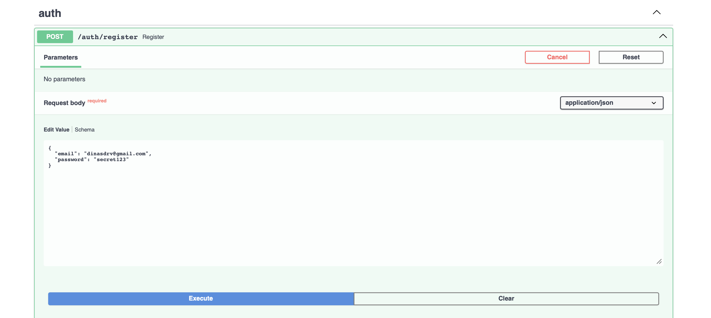
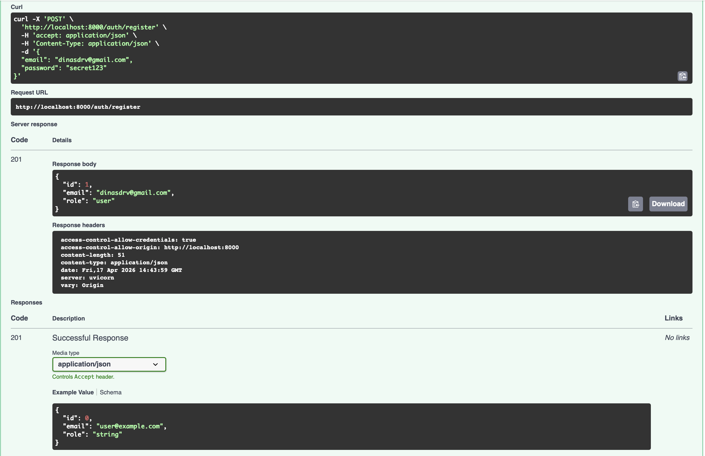
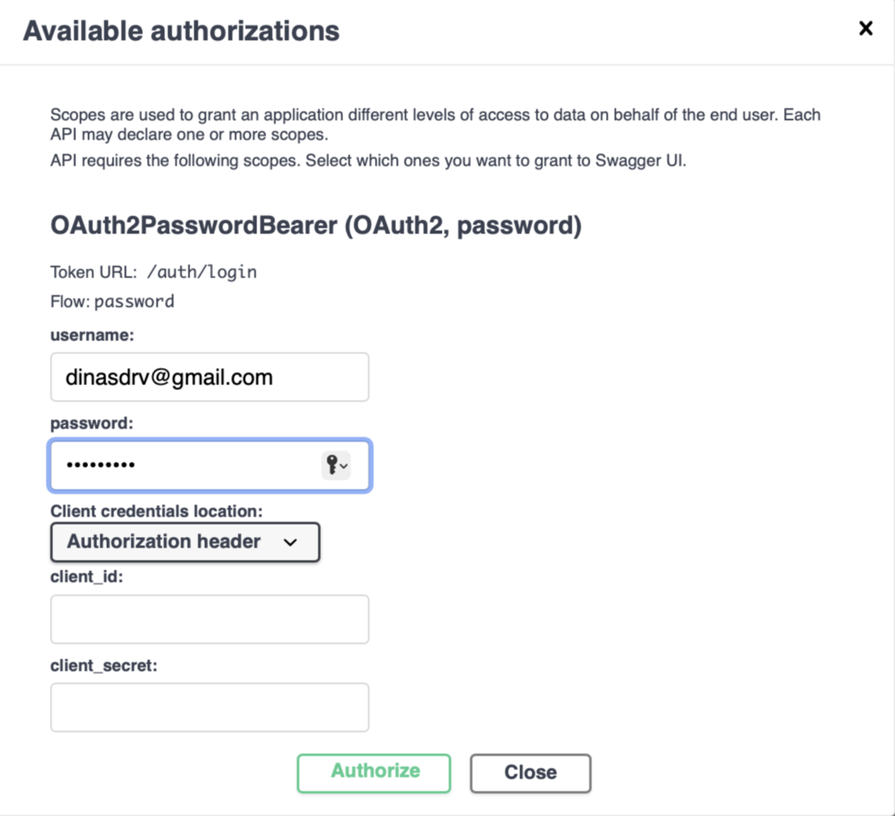
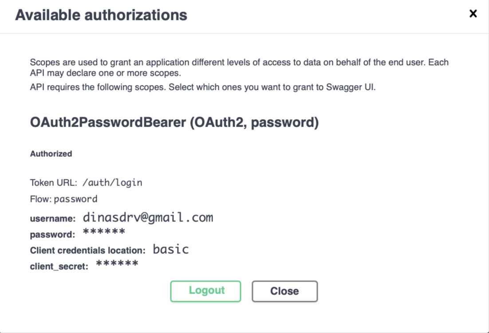
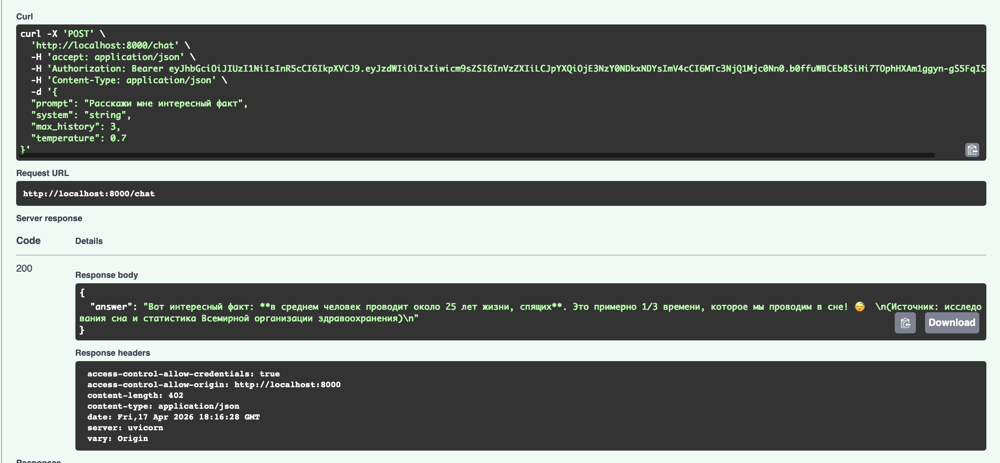
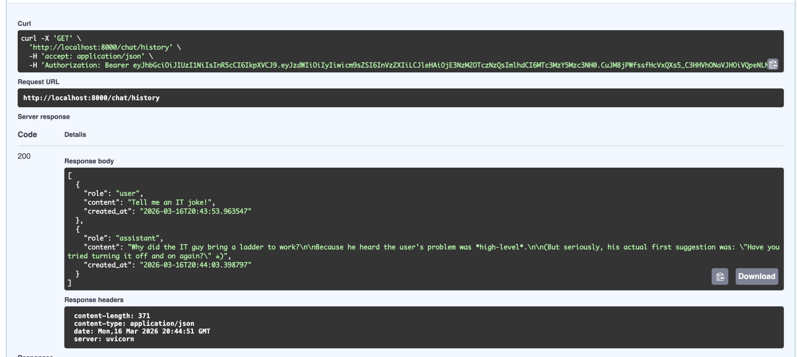

# llm-p

Учебный проект: небольшой FastAPI-сервис, через который можно логиниться и общаться с LLM через OpenRouter. История диалога хранится в SQLite и привязана к пользователю.

## Стек

- FastAPI + Uvicorn
- SQLAlchemy 2.0 async + aiosqlite (чтобы всё было на `async/await`)
- python-jose для JWT, passlib[bcrypt] для паролей
- httpx для похода в OpenRouter
- uv как пакетный менеджер, ruff для линтинга

## Что где лежит

```
app/
├── main.py              # create_app(), /health, lifespan
├── core/
│   ├── config.py        # настройки из .env
│   ├── security.py      # JWT + хэш пароля
│   └── errors.py        # свои исключения
├── db/
│   ├── base.py
│   ├── session.py
│   └── models.py        # User, ChatMessage
├── schemas/             # Pydantic-схемы запросов/ответов
├── repositories/        # работа с БД, голый SQL/ORM
├── services/
│   └── openrouter_client.py
├── usecases/            # логика: auth, chat
└── api/                 # роуты + DI
```

Идея простая: роуты не ходят в БД напрямую и ничего не знают про httpx. Запрос приходит в `api/`, там через Depends собираются зависимости, дальше usecase дёргает нужный repository (БД) или service (OpenRouter). Если что-то сломалось — бросается доменная ошибка, а уже роут превращает её в HTTP-код.

## Как запустить

Нужен Python 3.11+ и `uv`.

```bash
pip install uv
uv venv
source .venv/bin/activate          # на маке/линуксе
uv pip install -r <(uv pip compile pyproject.toml)

cp .env.example .env
# вставить свой OPENROUTER_API_KEY

uv run uvicorn app.main:app --reload
```

Swagger — на http://0.0.0.0:8000/docs.

Есть `Makefile`, если лень писать команды целиком: `make install`, `make run`, `make lint`, `make fmt`.

## .env

```dotenv
APP_NAME=llm-p
ENV=local

JWT_SECRET=change_me_super_secret
JWT_ALG=HS256
ACCESS_TOKEN_EXPIRE_MINUTES=60

SQLITE_PATH=./app.db

OPENROUTER_API_KEY=
OPENROUTER_BASE_URL=https://openrouter.ai/api/v1
OPENROUTER_MODEL=stepfun/step-3.5-flash:free
OPENROUTER_SITE_URL=https://example.com
OPENROUTER_APP_NAME=llm-fastapi-openrouter
```

Ключ берётся на openrouter.ai и вставляется в `.env` без кавычек.

## Эндпоинты

| Метод  | Путь             | JWT | Что делает                    |
|--------|------------------|:---:|-------------------------------|
| GET    | /health          | —   | проверка, что сервис живой    |
| POST   | /auth/register   | —   | регистрация                   |
| POST   | /auth/login      | —   | логин через OAuth2 password   |
| GET    | /auth/me         | ✅  | мой профиль                   |
| POST   | /chat            | ✅  | вопрос к LLM                  |
| GET    | /chat/history    | ✅  | моя история сообщений         |
| DELETE | /chat/history    | ✅  | очистить историю              |

## Скриншоты

Все скрины — в `docs/screenshots/`. Регистрация сделана на `dinasdrv@gmail.com`, email видно на каждом.

### Регистрация — `POST /auth/register`

```bash
curl -X POST http://0.0.0.0:8000/auth/register \
  -H "Content-Type: application/json" \
  -d '{"email":"dinasdrv@gmail.com","password":"secret123"}'
```

Ответ 201:

```json
{
  "id": 1,
  "email": "dinasdrv@gmail.com",
  "role": "user"
}
```




### Логин — `POST /auth/login`

Тут OAuth2 password flow (через `OAuth2PasswordRequestForm`), поэтому в `username` передаётся email. В Сваггере удобнее залогиниться через кнопку Authorize — он сам вызовет `/auth/login` и подставит токен в заголовок `Authorization: Bearer ...`.

```bash
curl -X POST http://0.0.0.0:8000/auth/login \
  -H "Content-Type: application/x-www-form-urlencoded" \
  -d "username=dinasdrv@gmail.com&password=secret123"
```

```json
{
  "access_token": "eyJhbGciOi...",
  "token_type": "bearer"
}
```




### Запрос к LLM — `POST /chat`

```bash
curl -X POST http://0.0.0.0:8000/chat \
  -H "Authorization: Bearer <JWT>" \
  -H "Content-Type: application/json" \
  -d '{"prompt":"Привет, в каком году появился Python?","system":"","max_history":12,"temperature":0.7}'
```

Ответ:

```json
{"answer": "Язык Python появился в 1991 году..."}
```



### История — `GET /chat/history`

Отдаёт все сообщения пользователя в хронологическом порядке. Сообщения привязаны к `user_id`, поэтому чужую переписку не увидеть.




### Очистка — `DELETE /chat/history`

```bash
curl -X DELETE http://0.0.0.0:8000/chat/history -H "Authorization: Bearer <JWT>"
# 204 No Content
```

## Про безопасность

- пароли лежат в БД только как bcrypt-хэши
- JWT подписывается HS256, живёт `ACCESS_TOKEN_EXPIRE_MINUTES` минут
- на `/auth/me`, `/chat`, `/chat/history` без токена прилетает 401
- каждое сообщение привязано к `user_id` — чужую историю не достать

## Если OpenRouter ругается

Если ключ невалидный, или модель недоступна, или прилетел rate limit — клиент OpenRouter кидает `ExternalServiceError`, а роут `/chat` превращает это в 502. То есть само приложение не падает, пользователь получает нормальный HTTP-код.

## Проверить, что всё работает

```bash
curl http://0.0.0.0:8000/health
# {"status":"ok","env":"local"}

# без токена защищённые эндпоинты не пускают
curl -i http://0.0.0.0:8000/auth/me
# HTTP/1.1 401 Unauthorized
```

## Линтер

```bash
uv run ruff check .
```

Должно быть `All checks passed!`.
