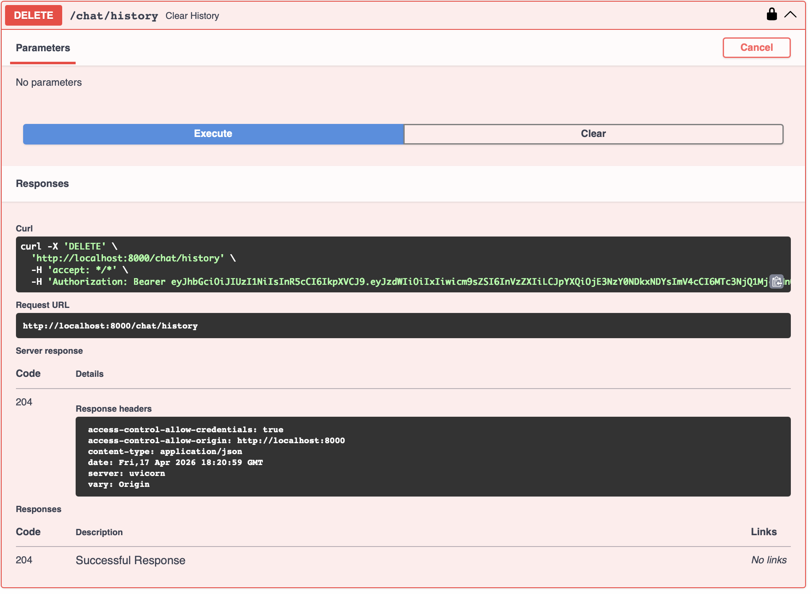

# Защищённый API для работы с большой языковой моделью

FastAPI-сервис с JWT-аутентификацией, SQLite и проксированием запросов к LLM через OpenRouter.


## Установка и запуск

### 1. Установка uv

```bash
pip install uv
```

### 2. Настройка переменных окружения

Скопируйте `.env.example` в `.env` и заполните `OPENROUTER_API_KEY`:

```bash
cp .env.example .env
```

### 3. Запуск приложения

```bash
uv run uvicorn app.main:app --reload --host 0.0.0.0 --port 8000
```

После запуска Swagger UI доступен по адресу: http://localhost:8000/docs

### 4. Проверка кода линтером

```bash
uv run ruff check
```

## Эндпоинты

### Auth
- `POST /auth/register` — Регистрация пользователя
- `POST /auth/login` — Логин и получение JWT
- `GET /auth/me` — Профиль текущего пользователя

### Chat
- `POST /chat` — Отправка запроса к LLM
- `GET /chat/history` — Получение истории диалога
- `DELETE /chat/history` — Очистка истории диалога

### Health
- `GET /health` — Проверка статуса сервера

## Скриншоты

Все скриншоты— в `docs/screenshots/`. Регистрация сделана на `dinasdrv@gmail.com`, email видно на каждом.

### Регистрация — `POST /auth/register`

`POST /auth/register` — запрос:


`POST /auth/register` — ответ:


### Логин — `POST /auth/login`

`POST /auth/login` — запрос:'


`POST /auth/login` — ответ:


### Запрос к LLM — `POST /chat`

`POST /chat` — отправка запроса к LLM:


### История — `GET /chat/history`

`GET /chat/history` — получение истории:


### Очистка — `DELETE /chat/history`

`DELETE /chat/history` — очистка истории:


